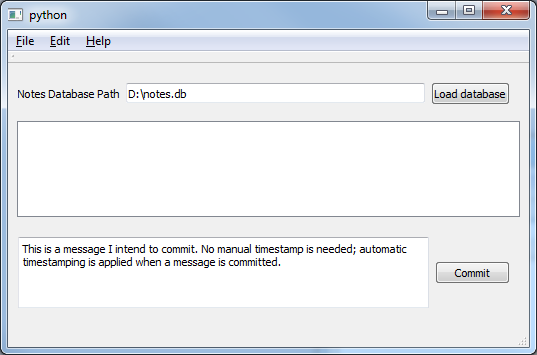

# notetaker
NoteTaker is a multi-user note-taking application that stores notes from multiple users into a single central location asynchronously. The application automatically attaches a timestamp to committed messages and updates all connected clients with the latest messages. It supports plain text editing and can parse MultiMarkdown to display tables and inline images NoteTaker also supports arbitrary attachments.

NoteTaker relies on sqlalchemy, PySide or PyQt, passlib, and [Qt.py](https://github.com/mottosso/Qt.py) (a minimal Python 2 & 3 shim around all Qt bindings)
